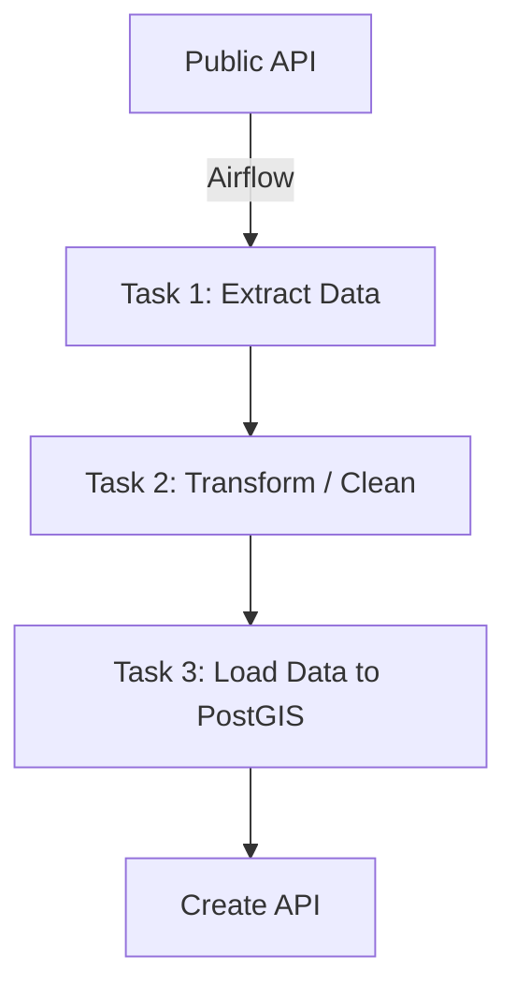

# Project Earthquakes Data Pipeline

โปรเจกต์นี้คือการจำลองระบบ Data Pipeline แบบ End-to-End โดยใช้ **Apache Airflow** เพื่อดึงข้อมูลเหตุการณ์แผ่นดินไหวล่าสุดจาก Public API, ประมวลผล, และจัดเก็บในฐานข้อมูลเชิงพื้นที่ (**PostGIS**) เพื่อพร้อมนำไปแสดงผลผ่าน API (**FastAPI**).

---

## เครื่องมือ (Tech Stack)

| ประเภท | เครื่องมือ | บทบาทในโปรเจกต์ |
| :--- | :--- | :--- |
| **Orchestration** | **Apache Airflow** | จัดการ Workflow ETL/ELT และกำหนดตารางเวลาการรัน (Scheduler) |
| **Containerization** | **Docker / Docker Compose** | สร้างและจัดการสภาพแวดล้อมทั้งหมด (Airflow, Databases, API) |
| **Database** | **PostgreSQL / PostGIS** | เป็น Metadata Database ของ Airflow และเป็น Data Warehouse สำหรับเก็บข้อมูลแผ่นดินไหว (PostGIS ใช้สำหรับการวิเคราะห์เชิงพื้นที่) |
| **ETL/API Logic** | **Python** | ใช้ในการเขียน Logic สำหรับการดึงข้อมูล, แปลงข้อมูล (ETL Scripts) และสร้าง API Server (FastAPI) |
| **API Framework** | **FastAPI** | สร้าง RESTful API สำหรับแสดงผลข้อมูลสรุปแผ่นดินไหวรายชั่วโมง |

---

## แหล่งข้อมูล (Data Sources)

* **Public API:** 

---

## สถาปัตยกรรมและ Workflow Diagram

นี่คือแผนภาพแสดงขั้นตอนการทำงานของ Data Pipeline ทั้งหมด:
## **Workflow Diagram**

